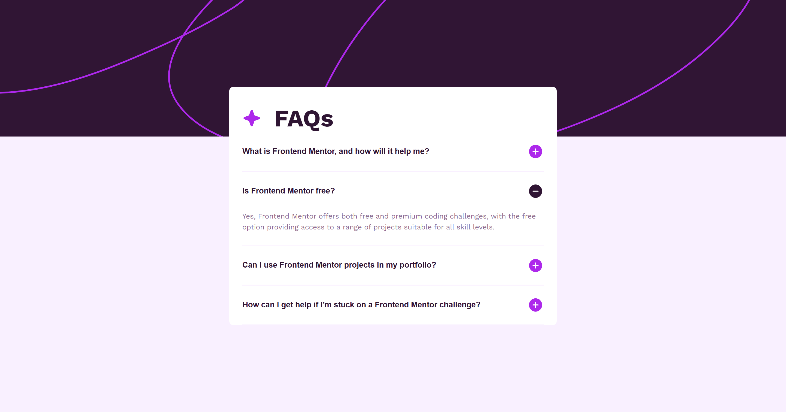

# FAQ accordion

This is a responsive FAQ accordion component built as a Frontend Mentor practice project.
Users can toggle questions to reveal or hide answers using JavaScript.
The layout adapts to different screen sizes and follows accessibility best practices.

## Screenshot

## Live Demo

🌐 [View Live Site](https://evija-berzina.github.io/frontendmentor-faq-accordion/)

## Built With

- HTML
- CSS
- JavaScript

## What I Practiced

- semantic HTML structure
- CSS layout and responsive design
- JavaScript DOM manipulation, using data attributes

